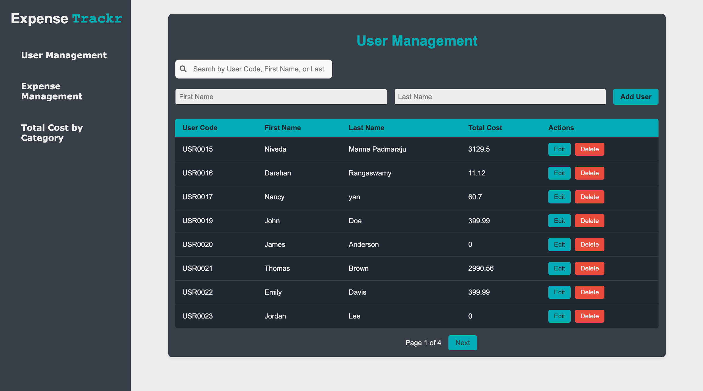
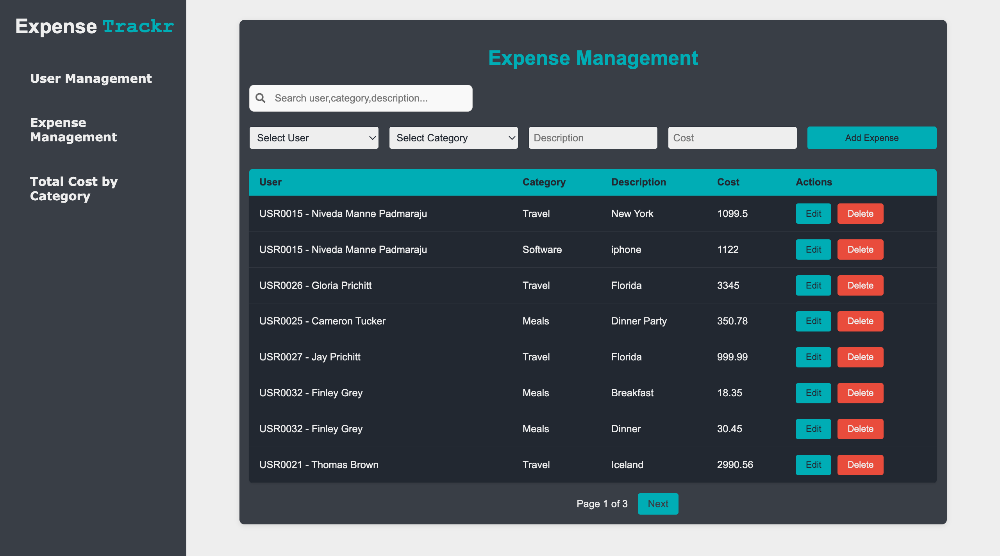
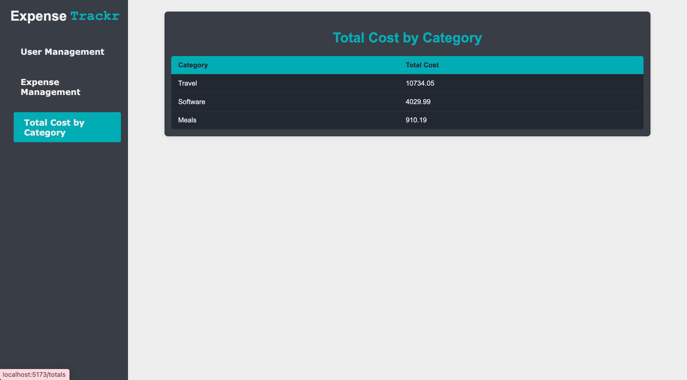
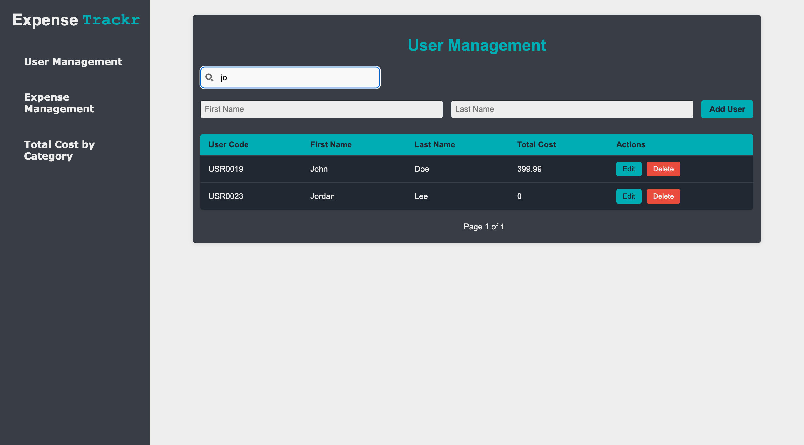

Expense Tracker Application

📄 Project Summary

The Expense Tracker Application is a robust and user-friendly tool designed to simplify expense management. It empowers users to:

- Add, update, and delete expense records.
- Categorize expenses under predefined categories (e.g., Meals, Travel, Software).
- View total expenses by category with clear visualizations.
- Manage user details associated with expenses, including user codes and expense summaries.
- Search and filter expenses or users for quick access to relevant information.
- Paginate through large datasets, ensuring smooth navigation for better usability.
- Handle errors gracefully, providing meaningful feedback to users.

Designed with scalability and user experience in mind, the application ensures smooth operation even with large datasets.

---

🌟 Features

Expense Management
- Create, edit, delete, and view expense records with associated categories.
- Quickly view total costs for specific categories or users.

User Management
- Add, update, delete, and view user details such as first name, last name, and user codes.
- See cumulative expenses per user.

Search Functionality
- Filter expenses by user name, category, or description.
- Filter users by first name, last name, or user code for quick lookups.

Pagination
- Seamlessly navigate through large datasets with intuitive pagination controls.

Notifications
- Real-time toast notifications for user actions (e.g., "Expense added successfully").

Total Cost by Category
- Display total expenses grouped by category, helping users understand spending patterns.

Error Handling
- Clear and actionable error messages for invalid inputs and server issues.

Loading Indicators
- Spinners to enhance user experience during data fetch operations.

---

Video Demostration link: https://drive.google.com/file/d/1ptcoYobjZ1SEh2ilnudwRbQKO2POen6T/view?usp=sharing

---


🚀 How to Run the Project

Prerequisites
- Node.js installed on your system.
- MongoDB database connection string.
- A package manager (npm or xyarn).

Backend Setup
1. Navigate to the backend folder:
   ```bash
   cd backend
   ```

2. Install dependencies:
   ```bash
   npm install
   ```

3. Create a `.env` file in the backend folder with the following variables:
   ```plaintext
   MONGO_URI=your_mongo_connection_string
   PORT=5002
   ```

4. Start the server:
   ```bash
   npm start
   ```

5. The backend server will run on [http://localhost:5002](http://localhost:5002).

Frontend Setup
1. Navigate to the frontend folder:
   ```bash
   cd frontend
   ```

2. Install dependencies:
   ```bash
   npm install
   ```

3. Start the development server:
   ```bash
   npm run dev
   ```

4. The frontend server will run on [http://localhost:5173](http://localhost:5173) (default Vite port).

---

📊 Design and Implementation Tradeoffs

1. Data Model Simplification
- A straightforward MongoDB schema is used for users and expenses.
- While efficient for current needs, more complex relationships (e.g., multi-level categorization) may require schema redesigns.

2. Pagination
- Pagination is implemented on the client side for simplicity. Server-side pagination may be more efficient for larger datasets.

3. Search Functionality
- Implemented client-side for responsiveness. For larger datasets, this could be optimized to work server-side.

4. Notifications
- React-toastify is used for notifications, improving feedback for user actions.

5. Loading Indicators
- Basic spinners are used during data fetches. This can be enhanced with skeleton loaders for better UX.

---
🎨 Visuals

User Management


Expense Management


Total Costs By Category


Search and Filter in Action


---

⚙️ Technologies Used

Frontend
- React.js
- Vite (for fast development and builds)
- React Toastify (for notifications)
- React Icons (for UI icons)

Backend
- Express.js (routing and middleware)
- MongoDB (database)
- Mongoose (MongoDB ORM)

Others
- Axios (for API communication)
- CSS Modules (for component-specific styles)

---

💡 Future Enhancements
- Server-side search and pagination for optimized performance with large datasets.
- Advanced filtering (e.g., date ranges, expense amounts).
- Dashboard analytics with charts for detailed insights.
- Authentication for secure access control.

---

📩 Contact
For any questions or issues, please contact at [nivedithamp23@gmail.com].

---
